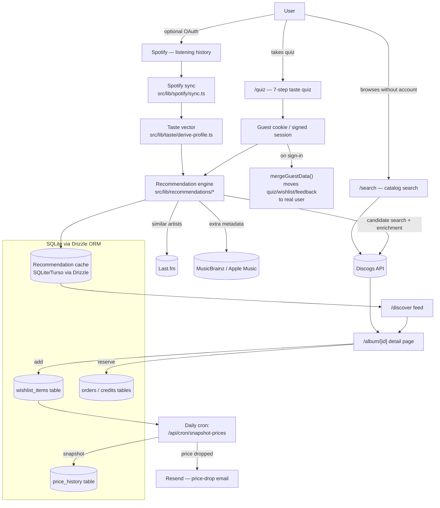

# Record Finder

A vinyl discovery app that turns your Spotify listening history (or a quick taste quiz) into personalized vinyl record recommendations, sourced from Discogs, with pricing, fair-value signals, and price-drop alerts.

## What this is

Record Finder helps people find vinyl records worth buying. Instead of scrolling Discogs' full catalog with no guidance, you either:

- Take a short taste quiz (genres, decades, moods, "would you rather" album battles), or
- Connect your Spotify account so the app can read what you actually listen to,

and the app returns a personalized feed of vinyl records it thinks you'll like, pulled from Discogs' real, buyable catalog — complete with condition, pressing details, community ratings, and current marketplace prices.

Beyond recommendations, it also works as a full vinyl search engine (no account needed), tracks price history on records you wishlist so it can tell you when something is a genuinely good deal (not just "cheap compared to the other picks on this page"), and emails you when a wishlisted record's price drops. A small credits/reservation system lets users hold a concierge queue spot for a record.

You don't need an account to search or take the quiz. Signing in with Spotify unlocks sharper recommendations, a wishlist with price alerts, and reservations.

## Key features

- **No-signup catalog search** (`/search`) — full-text search across Discogs' entire vinyl catalog.
- **Taste quiz** (`/quiz`) — a 7-step flow (genres, sub-genres, decades, moods, album A-vs-B battles, listening style, deep-cut preference) that works without an account; answers are tied to a signed guest cookie.
- **Spotify-powered recommendations** (`/discover`) — pulls top artists/tracks, recently played, and saved music from Spotify, derives a "taste vector," and scores Discogs candidates against it.
- **Album detail pages** — pressing/matrix/runout details, mastering credits, a cross-pressing comparison across all known versions of a release, marketplace pricing, and a fair-value badge.
- **Wishlist with price-drop alerts** — daily price snapshots for wishlisted records; users get emailed when the price drops meaningfully below what they've seen before.
- **Multi-source "where to buy" offers** — normalizes buy options from multiple sources (beyond Discogs) into one ranked, cheapest-first list, matched by barcode/artist/title.
- **Credits & reservations** — a lightweight credits system that lets a user reserve a concierge queue spot on a record, with a "N collectors already reserved" scarcity indicator.
- **Guest-to-account merge** — quiz answers, wishlist, feedback, and Spotify data collected as a guest automatically merge into the real account on sign-in.
- **Themeable UI** — six visual themes (e.g. `record-store-noir`, `midnight-wax`, `neon-crate`) with an ambient CSS "spinning vinyl" scene on the darker themes.

## How it works

**Two entry points into recommendations:**

1. **Search path (no account):** type a query → hits Discogs' search API directly → results enriched with price/rating → shown in a grid.
2. **Personalization path:** complete the quiz (and optionally connect Spotify) → the app builds a "taste profile" → a recommendation pipeline scores Discogs candidates against it → results are cached and shown on `/discover`.

**Recommendation pipeline** (`src/lib/recommendations/load.ts`), roughly:

1. Require a completed quiz; serve a cached result if it's fresh (1-hour TTL).
2. If Spotify is connected and the listening snapshot is stale, re-sync from Spotify first.
3. Generate candidates — either from Spotify signals (saved albums, trending/core artists, Last.fm similar artists, taste-vector genres) or, for quiz-only users, from a weighted sample across their favorite genre × decade combinations.
4. Score each candidate against the taste profile (artist/album affinity, recent listening, quiz answers, feedback history, etc.).
5. Remove items the user already marked as owned/hidden; de-duplicate cross-pressings of the same release; diversify results across genres.
6. Enrich the surviving candidates with live Discogs data (rating, price, want/have counts) via one API call per pick.
7. Blend relevance, quiz fit, community rating, and desirability into a single 0–100 score.
8. Flag "fair value" picks (cheap relative to the batch, or — for records with enough price history — cheap relative to their own historical median price).
9. Cache the result.

**Data flow diagram:**



## Tech stack

| Layer | Choice |
|---|---|
| Framework | Next.js 16 (App Router), React 19, TypeScript |
| Styling / motion | Tailwind CSS v4, hand-rolled UI primitives (no component library); GSAP + Framer Motion for animation |
| Auth | NextAuth v5, Spotify OAuth as the only provider |
| Database | SQLite via Drizzle ORM and `@libsql/client` (local file `./data/record_finder.db`; Turso for hosted/prod) |
| External APIs | Discogs (source of truth for vinyl catalog, pricing, marketplace), Spotify Web API, Last.fm, MusicBrainz, Apple Music (iTunes Search API) |
| Email | Resend (wishlist price-drop alerts) |
| Scheduled jobs | Vercel Cron, configured in `vercel.json` (`/api/cron/snapshot-prices`, daily) |
| Validation | Zod |
| Testing | Vitest |
| Deployment | Vercel |

## Project structure

```
src/
  app/
    (app)/            Pages: home, discover, quiz, search, dashboard, credits, wishlist
    api/               Route handlers: recommendations, discogs, spotify, wishlist,
                        credits, reservations, feedback, quiz, cron, auth, analytics
  components/
    discover/          Recommendation feed UI (grid, carousels, filters)
    search/            Catalog search UI
    quiz/               Taste quiz flow
    album/              Album detail, pressing comparison, offers, reserve/wishlist actions
    home/               Landing page hero and listening-intent nudges
    noir/               Ambient/theming visual scene
    ui/                 Shared low-level UI primitives (button, modal, input, etc.)
  lib/
    recommendations/    Scoring engine, dedupe/diversify, finalize, fair-value logic
    spotify/            Spotify API client and listening-history sync
    taste/              Taste vector derivation from Spotify + quiz data
    discogs/            Discogs API client (search, release, marketplace, master versions)
    offers/             Multi-source "where to buy" normalization and matching
    commerce/           Price-drop alert logic
    email/               Price-drop email templates and Resend sending wrapper
    db/                 Drizzle query helpers
    quiz/               Quiz content (sub-genres, album battle pairs)
    lastfm/, apple-music/, musicbrainz/   Secondary enrichment API clients
drizzle/
  schema.ts             Database schema (Drizzle ORM)
  migrations/            SQL migration history
```

## Setup / running locally

Requirements: Node.js, a Discogs personal access token, and a Spotify developer app (for sign-in).

```bash
npm install

cp .env.example .env
# fill in at minimum:
#   DISCOGS_TOKEN     (https://www.discogs.com/settings/developers)
#   SPOTIFY_CLIENT_ID / SPOTIFY_CLIENT_SECRET  (https://developer.spotify.com/dashboard)
#   AUTH_SECRET       (openssl rand -base64 32)
# DATABASE_URL defaults to a local SQLite file — no setup needed

npm run db:push   # apply the Drizzle schema to the local SQLite DB

npm run dev        # start the app at http://localhost:3000
```

Other useful scripts:

```bash
npm run build         # production build
npm run start          # run the production build
npm run lint           # ESLint
npm test               # run the Vitest suite once
npm run test:watch     # Vitest in watch mode
npm run db:generate    # generate a new Drizzle migration from schema changes
```

Optional environment variables (see `.env.example` for full detail): `LASTFM_API_KEY` (similar-artist enrichment), `TURSO_DATABASE_URL`/`TURSO_AUTH_TOKEN` (hosted DB), `CRON_SECRET` (required for the price-snapshot cron to accept requests once deployed), `RESEND_API_KEY`/`RESEND_FROM_EMAIL` (price-drop emails — without it, snapshotting still runs, alerts are just skipped), `ADMIN_EMAIL` (gates the `/dashboard` metrics page to one email).

## Notable implementation details

- **Guest-first design.** Search and the quiz work with zero sign-in via a signed guest cookie; all guest data (quiz answers, wishlist, feedback, Spotify snapshot) is merged into the real account the moment someone signs in with Spotify (`mergeGuestData()`).
- **Score normalization.** Recommendation scores are blended from four independently normalized components — relevance, quiz fit, Bayesian-shrunk community rating, and want-count desirability (whose direction flips based on whether the user prefers mainstream or deep-cut picks) — rather than a single unbounded raw sum.
- **Fair value has two tiers.** By default it's relative to the current result batch (cheapest quartile / most-wanted quartile). For releases with at least three price-history snapshots (i.e. things people have wishlisted for a while), it upgrades to a real historical comparison against that release's own median price.
- **Bounded daily price snapshotting.** The cron job only tracks price history for wishlisted releases (not everything ever shown), and caps each run to 100 never-snapshotted, stalest-first releases, so Discogs API usage stays bounded regardless of wishlist growth.
- **Deduping across pressings.** The same album often exists as many different Discogs releases (different pressings/reissues); recommendations are de-duplicated by normalized artist+title so a user doesn't see the same album five times.
- **No 3D/WebGL.** An earlier WebGL ambient background was removed in favor of a CSS-only spinning-vinyl scene (better performance, honors `prefers-reduced-motion`).
- **Cron auth follows Vercel's convention** — the price-snapshot endpoint checks `Authorization: Bearer $CRON_SECRET`, not a custom header, matching how Vercel actually invokes scheduled functions.
